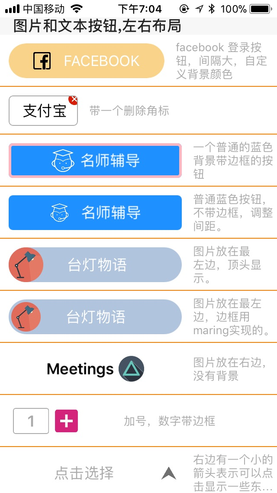
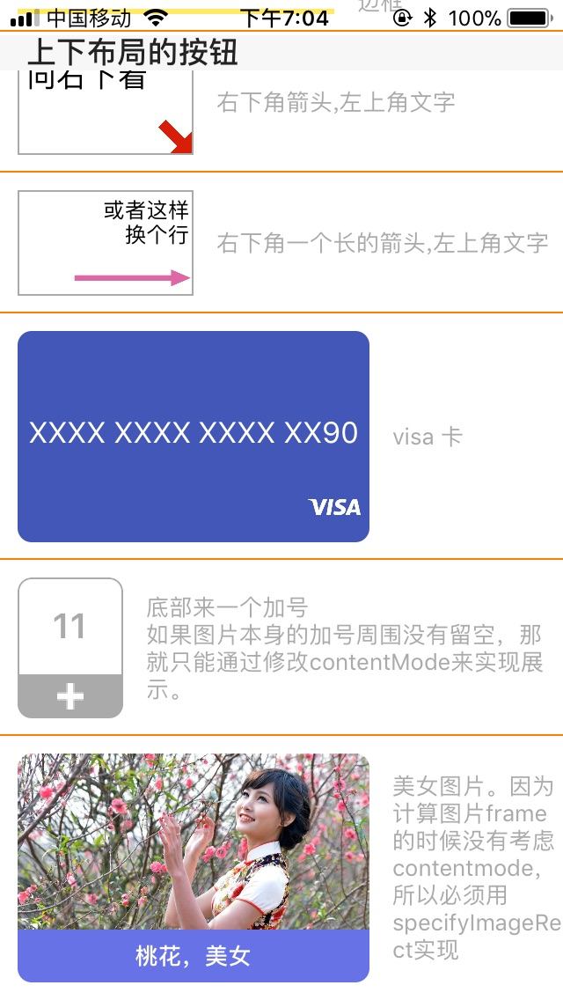

# UITButton
一个可以上下布局的按钮

封装这个按钮，最开始是因为项目中有好多地方都要用图片在上的按钮，而imageInsert又老是整不好。

后来想得多了，就想要研究一下实现一个相对灵活完善的按钮，内部需要做多少逻辑，以及其性能如何；同时为封装的另一个Kotlin-UIKit做些准备。UIButton内部的逻辑知不道，所以参考UIButton的接口，自己实现了比较常用的功能。

## 目前支持的用法和效果：

## 属性说明：

* layoutType 布局方式，上下布局和左右布局

* imageLocation 图片位置

* verticalAlignment 竖直方向的对齐方式

* horizontalAlignment 水平方向的对齐方式

* marginInsets 边距的设定。默认四个值都是5.0

* padding 图片和文本之间的间距,默认也是5.0

* specifyImageRect 默认是zero。图片的frame，如果指定了这个，那图片的展示将会完全由这个属性指定。给出这个属性，是为了在有自定义图片frame的需要时，不至于被原有的frame计算干扰。

* specifyImageSize 默认是zero。图片的尺寸。因为有时我们选择的图片的尺寸显示在按钮上不合适，为了控制图片的大下，就需要手动设置，而不是修改图片素材的尺寸。如果只给了一个宽高属性，另一个不给，那么就会按照图片的宽高比进行计算，并自动修正。

* titleFill 默认为NO，填充title。当指定了图片的frame活size的时候，就会出现让文本填充剩余的全部空间的需求

## 成员函数

//设置状态相关的参数，当其他不设置的时候，就会默认使用normal的

	- (void)setImage:(UIImage *)image forState:(UIControlState)state;
	
设置图片，设置normal图片的时候，会自动生成一个增加灰度的图片用作高亮，模仿UIButton的点击效果

	- (void)setTitle:(NSString *)title forState:(UIControlState)state;

设置标题，同样会把normal的标题赋值给其他状态

	- (void)setTitleColor:(UIColor *)color forState:(UIControlState)state;

设置标题的颜色

	- (void)setBackgroundColor:(UIColor *)color forState:(UIControlState)state;

设置背景颜色。设置normal的背景颜色的时候，同样会自动生成一个增加灰度的背景图，用来在点击的时候有一个点击效果